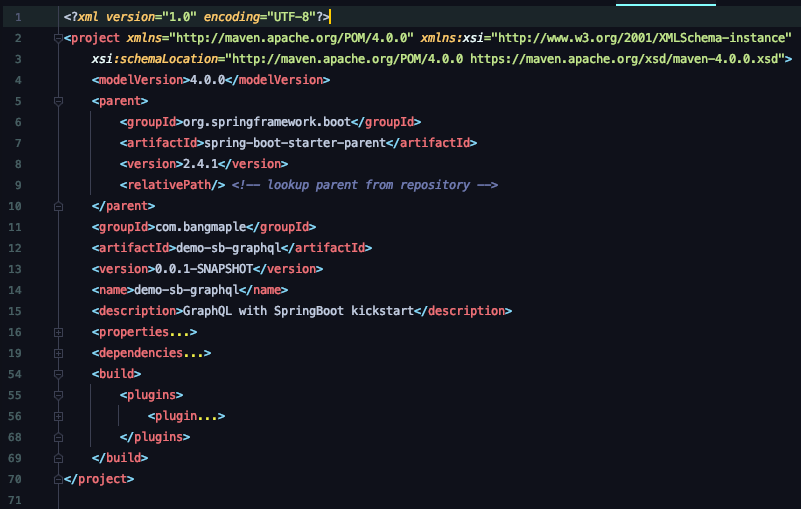
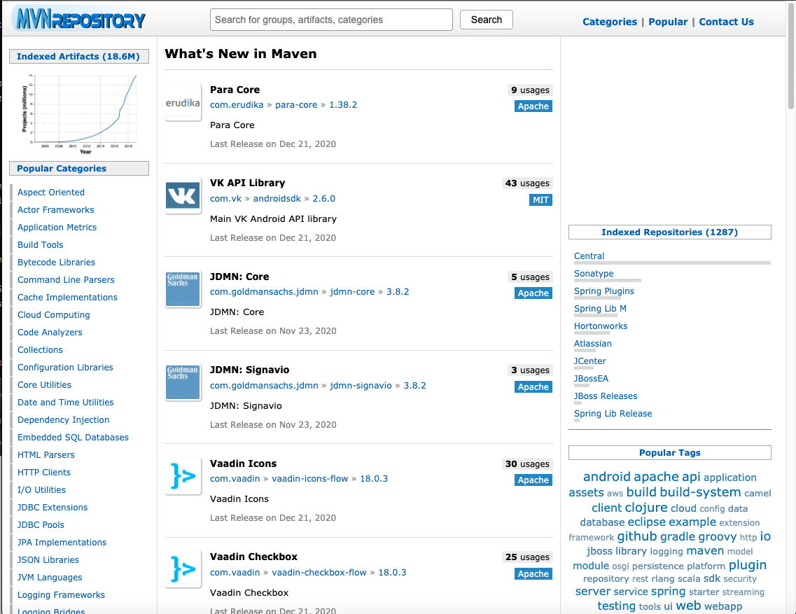
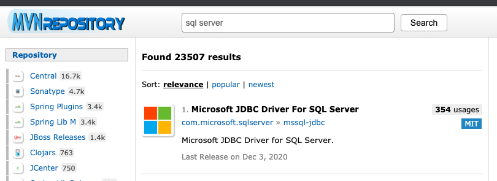
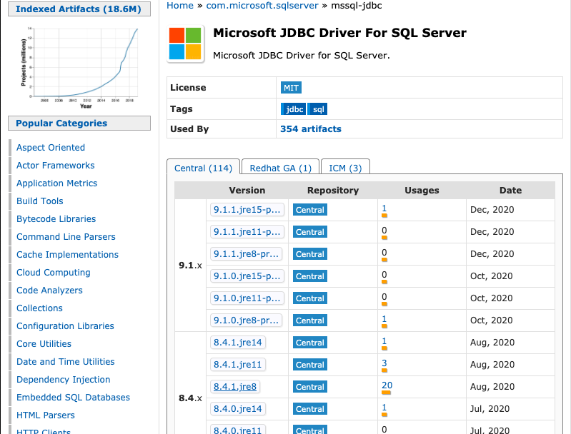
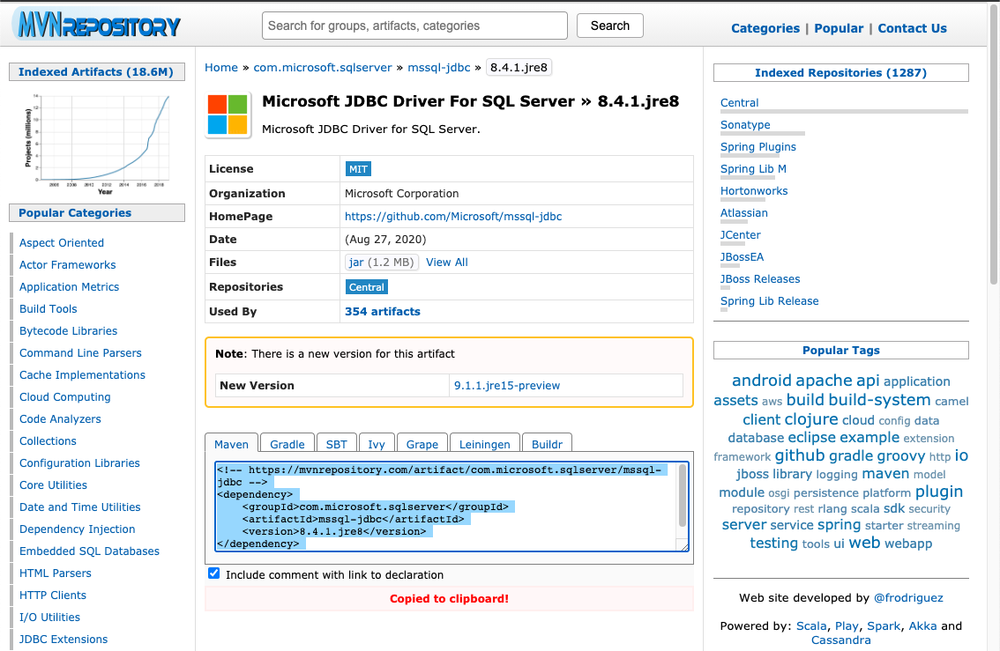
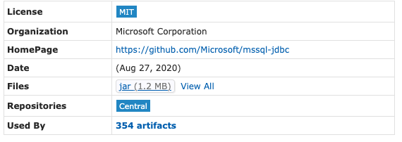
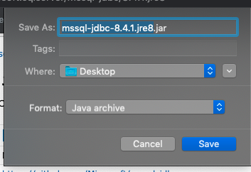
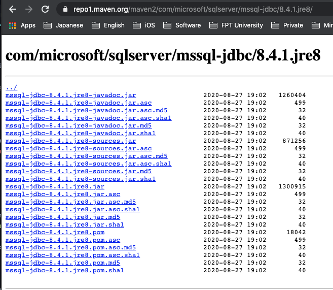
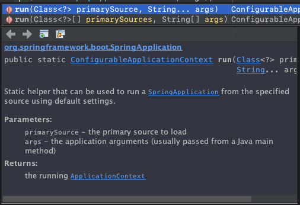
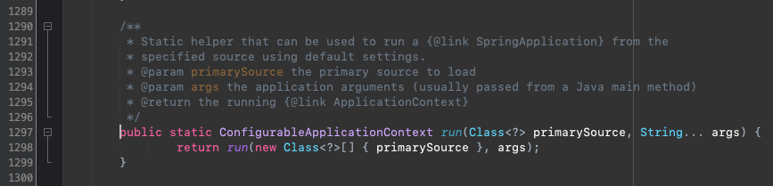

# GraphQL-kickstater-springboot-tutorial

<h1 align="center"> Add additional dependencies </h1>  

In this tutorial. We are going to show you how to integrate dependencies (libraries) into your own Maven project.
<!-- TABLE OF CONTENTS -->
<details open="open">
  <summary><h2 style="display: inline-block">Table of Contents</h2></summary>
  <ol>
    <li><a href="#step-1">What is Maven Dependency ?</a></li>
    <li><a href="#step-2">How and where to get the Maven dependencies integrated in our project ?</a></li>
    <li><a href="#step-3">Introduction to Jackson JSON Parser</a></li>
    <li><a href="#step-4">Introduction to GraphQL Spring Boot Kickstart</a></li>
  </ol>
</details>

## Let's begin

####  What is Maven Dependency ?
Before getting started with Maven Dependency, we need to know what a <i>pom.xml</i> file is.
Every Maven project always has a <i>pom.xml</i> that defines what and how our project should do.

The figure below illustrates the definition of a <i>pom.xml</i> file when we open it.

This XML file contains the XSD link in the <b>project</b> tag which is XML Schema that will check the whether the XML is well-formed and validated or not.



The below XML snippet which is actually from the generation process when we did from the step 1 and taken from the <b>pom.xml</b> file.
```xml
	<groupId>com.bangmaple</groupId>
	<artifactId>demo-sb-graphql</artifactId>
	<version>0.0.1-SNAPSHOT</version>
	<name>demo-sb-graphql</name>
	<description>GraphQL with SpringBoot kickstart</description>
```

This XML snippet defined the version of Java we are using.
```xml
	<properties>
		<java.version>1.8</java.version>
	</properties>
```

In the <b>dependencies</b> tag, we can include the dependencies as we often call dependencies as <i>libraries</i> in normal Java project. For example: <i>Apache Ant build tool</i>
```xml
	<dependencies>
		<dependency>
			<groupId>org.springframework.boot</groupId>
			<artifactId>spring-boot-starter-data-jpa</artifactId>
		</dependency>
        ...
	</dependencies>
```

Look inside the <b>dependency</b> tag we have the <i>groupId, artifactId, version, scope, ...</i>.
If you are new to <b>Apache Maven</b>, you can download dependencies (libraries) from the <b>Maven Repository</b> just like how we download apps from the Google Play Store/App Store:



- Go to <a href="https://mvnrepository.com">Maven Repository</a>

- Search for a dependency. For example, I want to integrate/download the <b>Microsoft JDBC Driver For SQL Server</b>

- Select the corresponding version of the dependency and the version of Java of the project you are dealing with. For example, I select <b>8.4.1.jre8</b>.

- If I want to integrate this dependency into my project. I will need to copy the XML snippet from the text area.
```xml
<!-- https://mvnrepository.com/artifact/com.microsoft.sqlserver/mssql-jdbc -->
...
	<dependencies>
        ...
        <dependency>
            <groupId>com.microsoft.sqlserver</groupId>
            <artifactId>mssql-jdbc</artifactId>
            <version>8.4.1.jre8</version>
        </dependency>
        ...
</dependencies>
```
- Paste the clipboard into the <b>dependencies</b> tag of the <b>pom.xml</b>.
##### Please take note that this is just an example of how to integrate dependency into your Maven project. Please remove this dependency from the pom.xml file after finishing this step to avoid the further problem.

- If you are using other build tool like <b>Apache Ant</b> you will need to download the dependency as <i>jar</i> file(s).



Save it to the suitable path where you can find easily.



By clicking the <a href="https://repo1.maven.org/maven2/com/microsoft/sqlserver/mssql-jdbc/8.4.1.jre8">View all</a> label. You will be redirected to the site where contains many files you may need further.


We need to take a look at the name <strong>-javadoc.jar</strong> and <strong>-source.jar</strong>.

- The <b>javadoc</b> jar file contains the description of the class, variable, function definition you may need to know.




- The <b>source</b> jar file contains the source code of the dependency which can show us how that class or function behave.



In NetBeans IDE, we can see whether the dependency contains <i>downloaded dependency</i>, <i>javadoc</i>, <i>source</i>. You can download those just by right-clicking to that dependency of the current Maven project.
![imag]

####  Configure Project - Language - Spring Boot version - Project Metadata

Go to <a href="https://start.spring.io/">Spring Initializr</a> website to generate your own Spring Boot Project.
At the time of this tutorial created, this is how a Spring Initializr site looks like.


<b>Project</b> - <a href="https://maven.apache.org">Maven Project</a> is our tutorial's project type. If you demand using other project types, please let us know by creating an <b>Issue</b>.

<b>Language</b> - is the programming language you want to use in your project.


<b>Spring Boot</b> - the version of Spring Boot you want to use in your project. You will need to use the stable version of Spring Boot so as not to get any trouble with the other Spring dependencies.

For me, I will choose <b>2.4.1</b>


<b>Group</b> input section should resemble the package name or reverse DNS of your website and can contain subgroups as you see fit.

For me, I will type <b>com.bangmaple</b> because I own a website like that. 
If you currently don't own a website or domain, you can imagine your own.


<b>Artifact</b> should be specific to each artifact and by convention should be the filename, excluding extension.
It is the same as the project name.

For me, I will leave it default. After the compilation result and packed, I will got a new file called <b>demo.jar</b>


<b>Name</b> the name for your Maven project. For me, I will leave it default or as the same as the above.


<b>Description</b> is to describe your project. You can modify as your favor but for me, I will leave it defualt.


<b>Package name</b> describe how it will create an empty package in the project for you.


<b>Packaging</b> is how you will deploy your project.
 
By choosing the <b>JAR</b> option, you can run your project by simply executing the command <i>java -jar demo.jar</i> or by clicking the JAR file.

By choosing the <b>WAR</b> option, you will need to deploy your app to the <b>Servlet Container</b> if you want to run it.


<b>Java</b> - the version you want to use with your project.

We will be using the version <b>8</b>. Be careful if you use other Java version, it will likely to break the dependencies capabilities.


In order to follow the tutorial, I will configure the project like the below image.


To continue with the tutorial, click the <b>Add dependencies</b> button to integrate the libraries into your project template.

We will need to choose the following libraries:
<ul>
    <li>Lombok</li>
    <li>Spring Web</li>
    <li>MS SQL Server Driver</li>
    <li>Spring Data JPA</li>
</ul>

The description illustrates on each dependency, so you don't need to be worried about not understanding how each dependency works.

<i>After adding the dependencies</i>


#### Generate the current project template

To get the pre-generated project to your local computer, please click the <b>Generate</b> button or with the combination keys as it jot down right the button.

I'm using macOS operating system. If you are using the different OS, don't be scared if it has the different key symbol.


After you clicked the <b>Generate button</b>, the download box should be appeared right away depending on your browser.


#### Open the project with IDE (IntelliJ)

After having downloaded the generated project by Spring Initilizr, please extract the project compressed in a <b>zip</b> file extension.


If you are using other IDE, the method to open a project should be the same.

Open up IntelliJ IDE, click the <b>Open Project</b> section and navigate to your extracted project folder and you are ready to go.


#### Explore the opened project

This is how you open your project created by Spring Initializr Template Configurator


The below image is the overall view of the <b>pom.xml</b> file and we will help you to add the dependencies later.


#### Thank you

Thanks for watching the tutorial from the beginning to the end.
If you are facing any issue, don't hesitate to create a new <b>Issue</b>.