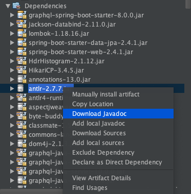

# GraphQL-kickstater-springboot-tutorial

<h1 align="center"> Add additional dependencies </h1>  

In this tutorial. We are going to show you how to integrate dependencies (libraries) into your own Maven project.
<!-- TABLE OF CONTENTS -->
<details open="open">
  <summary><h2 style="display: inline-block">Table of Contents</h2></summary>
  <ol>
    <li><a href="#step-1">What is Maven Dependency ?</a></li>
    <li><a href="#step-2">How and where to get the Maven dependencies integrated in our project ?</a></li>
    <li><a href="#step-3">Introduction to Jackson JSON Parser</a></li>
    <li><a href="#step-4">Introduction to GraphQL Spring Boot Kickstart</a></li>
  </ol>
</details>

## Let's begin

####  What is Maven Dependency ?
Before getting started with Maven Dependency, we need to know what a <i>pom.xml</i> file is.
Every Maven project always has a <i>pom.xml</i> that defines what and how our project should do.

The figure below illustrates the definition of a <i>pom.xml</i> file when we open it.

This XML file contains the XSD link in the <b>project</b> tag which is XML Schema that will check the whether the XML is well-formed and validated or not.


The below XML snippet which is actually from the generation process when we did from the step 1 and taken from the <b>pom.xml</b> file.
```xml
	<groupId>com.bangmaple</groupId>
	<artifactId>demo-sb-graphql</artifactId>
	<version>0.0.1-SNAPSHOT</version>
	<name>demo-sb-graphql</name>
	<description>GraphQL with SpringBoot kickstart</description>
```

This XML snippet defined the version of Java we are using.
```xml
	<properties>
		<java.version>1.8</java.version>
	</properties>
```

In the <b>dependencies</b> tag, we can include the dependencies as we often call dependencies as <i>libraries</i> in normal Java project. For example: <i>Apache Ant build tool</i>
```xml
	<dependencies>
		<dependency>
			<groupId>org.springframework.boot</groupId>
			<artifactId>spring-boot-starter-data-jpa</artifactId>
		</dependency>
        ...
	</dependencies>
```

#### How and where to get the Maven dependencies integrated in our project ?

Look inside the <b>dependency</b> tag we have the <i>groupId, artifactId, version, scope, ...</i>.
If you are new to <b>Apache Maven</b>, you can download dependencies (libraries) from the <b>Maven Repository</b> just like how we download apps from the Google Play Store/App Store:


- Go to <a href="https://mvnrepository.com">Maven Repository</a>

- Search for a dependency. For example, I want to integrate/download the <b>Microsoft JDBC Driver For SQL Server</b>

- Select the corresponding version of the dependency and the version of Java of the project you are dealing with. For example, I select <b>8.4.1.jre8</b>.

- If I want to integrate this dependency into my project. I will need to copy the XML snippet from the text area.
```xml
<!-- https://mvnrepository.com/artifact/com.microsoft.sqlserver/mssql-jdbc -->
...
	<dependencies>
        ...
        <dependency>
            <groupId>com.microsoft.sqlserver</groupId>
            <artifactId>mssql-jdbc</artifactId>
            <version>8.4.1.jre8</version>
        </dependency>
        ...
</dependencies>
```
- Paste the clipboard into the <b>dependencies</b> tag of the <b>pom.xml</b>.
##### Please take note that this is just an example of how to integrate dependency into your Maven project. Please remove this dependency from the pom.xml file after finishing this step to avoid the further problem.

- If you are using other build tool like <b>Apache Ant</b> you will need to download the dependency as <i>jar</i> file(s).


Save it to the suitable path where you can find easily.


By clicking the <a href="https://repo1.maven.org/maven2/com/microsoft/sqlserver/mssql-jdbc/8.4.1.jre8">View all</a> label. You will be redirected to the site where contains many files you may need further.


We need to take a look at the name <strong>-javadoc.jar</strong> and <strong>-source.jar</strong>.

- The <b>javadoc</b> jar file contains the description of the class, variable, function definition you may need to know.


- The <b>source</b> jar file contains the source code of the dependency which can show us how that class or function behave.


In NetBeans IDE, we can see whether the dependency contains <i>downloaded dependency</i>, <i>javadoc</i>, <i>source</i>. You can download those just by right-clicking to that dependency of the current Maven project.


In IntelliJ IDEA, we can check whether the <i>JavaDoc</i>, <i>Sources</i> of that dependency is downloaded or not.

By right-clicking the current project, navigating to <i>Module (Project) Settings -> Libraries</i>


#### Introduction to Jackson JSON Parser

Why not XML Parser?
- XML documents has been popular for decades for easy readability - a standard of configuration file/data storage-style for developers.
- Despite to its powerful features but recently due to the need of fast data transfer and old-style SOAP Architecture are overweight compare to REST Architecture and JSON data transfer.

Here is an example of how a XML data looks like:
```xml
<employees>
    <employee>
        <firstName>Bang</firstName>
        <lastName>Ngo</lastName>
    </employee>
    <employee>
        <firstName>Tien</firstName>
        <lastName>Truong</lastName>
    </employee>
    <employee>
        <firstName>Hoang</firstName>
        <lastName>Nguyen</lastName>
    </employee>
</employees>
```

And here is an example of how a JSON data looks like:

```json
{  
    "employees": [{  
        "firstName": "Bang",  
        "lastName": "Ngo"  
    }, {  
        "firstName": "Tien",  
        "lastName": "Truong"  
    }, {  
        "firstName": "Hoang",  
        "lastName": "Nguyen"  
    }]  
}  
```

As you can see the JSON-data structure looks simpler than the XML-data structure.

In <b>Java</b> programming language, we have the <b>JAX-B</b>, <b>JAX-P</b> (Java API for XML) to parse (unmarshal) the XML content to Java Objects and to convert (marshal) Java Objects back to XML content.

We can call this is a <b>Serialization</b> process to make a/an object(s) from the current language to the other language we want.

We may have written <b>Java Object</b> into text file(s) as binary which makes only Java Programming Language only understand that structure but others can't even it's not readable.

For people who studied the <b>Java Web</b> course at <b>FPT University</b>, you must have touched/configured the popular <b>web.xml</b> file.

Before the Java Web Application can be run, the <b>XML Parser</b> as in NetBeans IDE we have <b>SAX Parser (Simple API for XML)</b> to check whether the XML is well-formed and validated or not.

- Here is a list of XML Parser which are currently used at FPT University:
    - Java DOM Parser.
    - SAX Parser (Simple API for XML).
    - StAX Parser (Streaming API for XML).
    - TrAX Parser (Transformation API for XML).
- Going through to the JSON Parser, we can list the popular parsers:
    - Google GSON Parser.
    - Jackson JSON Parser.
    - DSL JSON Parser.
    - Java EE 8+ JSON Parser.

In this tutorial, we will show use show some examples of how to use Jackson JSON library at basic level in order to transform JSON to Java Object/Java Object to JSON.

You will need these 2 dependencies:
```xml
    <!-- https://mvnrepository.com/artifact/com.fasterxml.jackson.core/jackson-core -->
    <dependency>
        <groupId>com.fasterxml.jackson.core</groupId>
        <artifactId>jackson-core</artifactId>
        <version>2.12.0</version>
    </dependency>
    <!-- https://mvnrepository.com/artifact/com.fasterxml.jackson.core/jackson-databind -->
    <dependency>
        <groupId>com.fasterxml.jackson.core</groupId>
        <artifactId>jackson-databind</artifactId>
        <version>2.12.0</version>
    </dependency>
```

The below snippet code is an example of how to convert JSON data to Java Object Data with the output:

```
Employees{employees=[Employee{firstName='Bang', lastName='Ngo'}, Employee{firstName='Tien', lastName='Truong'}, Employee{firstName='Hoang', lastName='Nguyen'}]}

Process finished with exit code 0

```

```java
import com.fasterxml.jackson.databind.ObjectMapper;

import java.io.BufferedReader;
import java.io.FileReader;
import java.io.IOException;
import java.util.Arrays;

class Employee {
    private String firstName;
    private String lastName;
    /* Getter - Setter - ToString */
}

class Employees {
    private Employee[] employees;
    /* Getter - Setter - ToString */
}

public class Main {

    public static void main(String[] args) throws Exception {
        ObjectMapper objectMapper = new ObjectMapper();
        Employees empList = objectMapper
                .readValue(getEmployeesJSONFromFile(), Employees.class);
        System.out.println(empList);
    }

    private static String getEmployeesJSONFromFile() throws IOException {
        /*Read 'employees.json' file and return it as string*/
        return "Sample";
    }
}
```

The below snippet is an example of reading Java object - represented as ```Employees``` class and appended a new ```Employee``` and wrote back to the new JSON file:

```java
    public static void main(String[] args) throws Exception {
        ObjectMapper objectMapper = new ObjectMapper();

        Employees empList = objectMapper
                .readValue(getEmployeesJSONFromFile(), Employees.class);
        Employee emp = new Employee("Cong Thanh", "Pham");

        Employee[] emps = Stream
                .concat(Arrays.stream(empList.getEmployees()),
                        Arrays.stream(new Employee[]{emp}))
                .toArray(Employee[]::new);

        objectMapper.writeValue(new File("newEmployees.json"), new Employees(emps));
        System.out.println("Success!");
    }
```

Explore it more yourself!

#### Introduction to GraphQL Spring Boot Kickstart

In this tutorial, we assume you have already known REST architecture.

Take an example that I have a working WebService End-point which serves ```Student``` resources:

```
GET     /students       Get all students
GET     /student/{id}   Get specific student with given id
```

```java
class Student {
    private String id;
    private String name;
    private int age;
    private float height;
    private float avgMark;
    /* Constructor - Getter - Setter */
}
```

Result with ```/student/1```:
```json
{
    "id": "1",
    "name": "bangmaple",
    "age": 20,
    "height": 178.0,
    "avgMark": 8.4
}
```

What if we only need a student with the specific id with only specific properties (id, name)?
```json
{
    "id": "1",
    "name": "bangmaple"
}
```
We are expecting to retrieve a student with fewer properties.

##### What is exactly GraphQL and why we need it?


In order to continue with the next tutorial, please add these dependencies into your ```pom.xml``` file:
```xml
<dependency>  
    <groupId>com.fasterxml.jackson.core</groupId>
    <artifactId>jackson-databind</artifactId>  
    <version>2.11.0</version>  
</dependency>
<dependency>
    <groupId>com.graphql-java-kickstart</groupId>  
    <artifactId>graphql-spring-boot-starter</artifactId>  
    <version>8.0.0</version>  
</dependency>  
<dependency>  
    <groupId>com.graphql-java-kickstart</groupId>  
    <artifactId>graphiql-spring-boot-starter</artifactId>  
    <version>8.0.0</version>  
    <scope>runtime</scope>  
</dependency>
```


#### Thank you

Thanks for watching the tutorial from the beginning to the end.
If you are facing any issue, don't hesitate to create a new <b>Issue</b>.