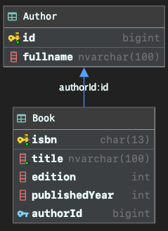

# GraphQL-kickstater-springboot-tutorial

<h1 align="center"> Create a new database </h1>  

In this tutorial. We are going to create a new database in MS SQL Server.
<!-- TABLE OF CONTENTS -->
<details open="open">
  <summary><h2 style="display: inline-block">Table of Contents</h2></summary>
  <ol>
    <li><a href="#step-1">Choose a database management studio</a></li>
    <li><a href="#step-2">Execute the query</a></li>
    <li><a href="#step-3">Review the database schema visualization</a></li>
  </ol>
</details>

## Let's begin

####  Choose a database management studio

In this tutorial, we will use ```Microsoft SQL Server``` as a database.

So we will need a database management studio in order to execute query, make changes to setting, ...

There are many management studio tools out there, such as:
- Microsoft SQL Server Management Studio
- DBeaver
- Navicat
- JetBrains DataGrip

Pick one are you are ready to go!

####  Execute the query

In this step, we will create a ```BookManagement``` database with ```Author``` and ```Book``` tables. 

Please execute each SQL Query in ascending order.

```sql
CREATE DATABASE BookManagement
```

```sql
USE BookManagement
```

```sql
CREATE TABLE Author (
    id BIGINT PRIMARY KEY,
    fullname NVARCHAR(100)
)
```

```sql
CREATE TABLE Book (
	isbn CHAR(13) PRIMARY KEY,
	title NVARCHAR(100) NOT NULL,
	edition INT,
	publishedYear INT,
	authorId BIGINT FOREIGN KEY REFERENCES Author(id)
)
```

```sql
INSERT INTO Author VALUES (1, N'Paulo Coelho');
INSERT INTO Author VALUES (2, N'Rosie Nguyễn');
INSERT INTO Author VALUES (3, N'Robin Sharma');

INSERT INTO Book VALUES ('2518407786529', N'The Alchemist (Nhà giả kim)', 1, 2013, 1);
INSERT INTO Book VALUES ('6911225907262', N'Tuổi Trẻ Đáng Giá Bao Nhiêu', 2, 2018, 2);
INSERT INTO Book VALUES ('2425402340697', N'Đời Ngắn Đừng Ngủ Dài', 2, 2014, 3);
```

#### Review the database schema diagram visualization



#### Thank you

Thanks for watching the tutorial from the beginning to the end.
If you are facing any issue, don't hesitate to create a new <b>Issue</b>.